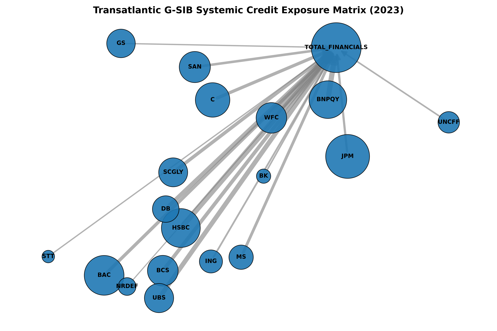

# 🏦 Global Banking Stress Monitor (GBSM)


> **Author:** Biswajeet Sahoo — Incoming MSc Business Analytics, Durham University (Sep 2026)  
> **Research:** Physics-Informed Deep Learning for Systemic Risk — [arXiv:2506.01179](https://arxiv.org/abs/2506.01179)  
> **Contact:** [LinkedIn](https://linkedin.com/in/biswajeet-sahoo-644204269)

---



*Force-directed network graph of the 39-bank G-SIB universe. Node size = eigenvector centrality. Edge thickness = estimated bilateral exposure.*

---

## Executive Summary

The **Global Banking Stress Monitor** is an end-to-end quantitative pipeline that measures, models, and visualises systemic risk across the 39 banks on the Financial Stability Board's Global Systemically Important Banks (G-SIB) list — the exact universe that regulators, central banks, and the BIS use to assess global financial stability.

The system aggregates four distinct dimensions of financial fragility into a single **Global Banking Stress Index (GBSI)**:

| Dimension | Model | Source |
|---|---|---|
| Systemic spillovers | ΔCoVaR | Adrian & Brunnermeier (2016) |
| Capital vulnerability | SRISK | Brownlees & Engle (2017) |
| Market fragility | Absorption Ratio (PCA) | Kritzman et al. (2011) |
| Network topology | PageRank + Betweenness Centrality | NetworkX on FR Y-9C data |

The GBSI is backtested against the COVID-19 liquidity shock (March 2020) and the SVB/Credit Suisse collapse (March 2023), the two major banking stress events within the 2019–2023 data window.

---

## The 39-Bank Universe

The project covers the FSB G-SIB list across six regions. Credit Suisse is excluded — it was acquired by UBS in June 2023 and delisted; UBS is retained as the surviving entity.

| Region | Banks |
|---|---|
| **United States (8)** | JPM, BAC, C, WFC, GS, MS, BK, STT |
| **Europe (14)** | HSBC, BCS, DB, UBS, ING, SAN, BNPQY, SCGLY, CRARY, SCBFF, UNCFF, NRDBY, DNKEY, ABN |
| **Japan (3)** | MUFG, SMFG, MFG |
| **China (4)** | IDCBY, CICHY, ACGBY, BACHY |
| **Other Asia-Pacific (6)** | DBSDY, HDB, CMWAY, WEBNF, ANZGY, NABZY |
| **Canada (5)** | RY, TD, BNS, BMO, CM |

---

## The Mathematics

Financial crises do not happen because a single bank makes a bad trade. They happen because banks are deeply interconnected — a shock to one institution propagates through the network and can collapse the system. This project quantifies exactly how.

### 1. ΔCoVaR — Systemic Spillover Risk

Developed by Adrian & Brunnermeier (2016). Traditional VaR measures how much a single bank might lose. ΔCoVaR measures how much the *entire financial system* stands to lose when one specific bank is in distress:

$$\Delta CoVaR_i = CoVaR^{q}_{system|X_i = VaR^q_i} - CoVaR^{q}_{system|X_i = median_i}$$

Implemented via 5th-percentile quantile regression conditioned on macro state variables (VIX, yield curve slope, HY credit spread, TED spread). If VaR measures the risk of a single house burning down, ΔCoVaR measures the risk the fire spreads to the entire neighbourhood.

### 2. SRISK — Capital Vulnerability

Developed by Brownlees & Engle (2017). While ΔCoVaR measures outward damage, SRISK measures inward damage — the capital shortfall a bank would face if global markets fell 40% over six months:

$$SRISK_i = k \cdot Debt_i - (1 - k) \cdot Equity_i \cdot (1 - LRMES_i)$$

where $k = 8\%$ is the prudential capital ratio and $LRMES_i$ is the Long-Run Marginal Expected Shortfall. SRISK is the "bailout bill" — how many billions a specific bank would need to survive a severe recession. Cross-validated against NYU Stern V-Lab public rankings.

### 3. Absorption Ratio — Market Fragility

A 252-day rolling PCA on the cross-sectional covariance matrix of bank stock returns. The absorption ratio measures the fraction of total variance explained by the first principal component:

$$AR = \frac{\sum_{j=1}^{n} \lambda_j^*}{\sum_{i=1}^{N} \sigma_i^2}$$

When AR spikes above 0.70, individual bank characteristics no longer matter — the market has become tightly coupled and primed for cascading failure. This is the earliest leading indicator in the system.

### 4. Network Topology — Interconnectedness

The interbank exposure network is constructed by extracting counterparty data from FR Y-9C regulatory filings (Schedule HC-H) and bank annual report footnotes across all 39 institutions. For each bank at each quarterly snapshot:

- **Degree centrality** — number of active counterparty relationships
- **Betweenness centrality** — whether the bank sits on critical credit flow paths  
- **Eigenvector centrality** — whether the bank is connected to other highly-connected banks (the "too-interconnected-to-fail" measure)
- **PageRank** — systemic importance weighted by the importance of counterparties

### 5. PIDL Model — Physics-Informed Deep Learning

The GBSI's final layer adapts the author's published PIDL architecture ([arXiv:2506.01179](https://arxiv.org/abs/2506.01179)) — a PyTorch encoder-decoder with Fokker-Planck dynamics and an entropy-constrained loss function — to the global 39-bank network. The Ruppeiner curvature metric serves as a phase-transition detector: changes in the thermodynamic geometry of the network precede crisis events. This is the only systemic risk early warning system in the literature that applies thermodynamic geometry to a global G-SIB network.

---

## Architecture & Data Stack

```
Data Sources                Processing Layer           Output
────────────────           ──────────────────          ──────────────
yfinance (equity)   ──►    data_pipeline.py    ──►    gsib_log_returns.csv
FRED API (macro)    ──►    data_pipeline.py    ──►    macro_stress_indicators.csv
FFIEC FR Y-9C       ──►    parse_fry9c_bulk.py ──►    us_banks_regulatory_raw.csv
Annual reports      ──►    [manual extraction] ──►    network_edges.csv
                               │
                               ▼
                    network_analysis.py  ──►  centrality_metrics.csv
                    risk_metrics.py      ──►  covar_srisk_output.csv
                    pidl_model.py        ──►  gbsi_scores.csv
                               │
                               ▼
                    early_warning.py     ──►  crisis_alerts.csv
                    dashboard.py         ──►  Streamlit live dashboard
```

**Market data:** 39 G-SIB tickers via `yfinance`, 2019–2024, 1,257 trading days, 100% coverage.

**Macro indicators:** VIX, HY credit spread, 2y/10y yield curve, TED spread (SOFR minus 3M T-Bill) via `fredapi`. TED spread computed manually — `TEDRATE` series was discontinued by FRED in 2023 and `USD3MTD156N` (LIBOR) no longer exists; SOFR is the correct successor.

**Regulatory data:** FR Y-9C bulk filings from FFIEC (Q4 annual, 2019–2023) for 8 US G-SIBs. MDRM field codes: `BHCH11`/`BHCH12` (interbank exposure), `BHCF1350` (fed funds sold), `BHCA7206` (CET1 ratio), `BHCF8693` (derivative notional).

**Network data:** Counterparty exposure footnotes extracted manually from 39 annual reports — this is the core irreplaceable data asset of the project, the data that no API provides.

---

## Repository Structure

```
global-banking-stress-monitor/
│
├── data/
│   ├── raw/
│   │   ├── fed_fry9c/          # FR Y-9C bulk ZIPs + extracted regulatory CSV
│   │   ├── annual_reports/     # Bank annual report PDFs (network construction)
│   │   └── market_data/        # Raw equity prices, macro indicators from APIs
│   └── processed/              # Cleaned outputs: network edges, risk metric CSVs
│
├── src/
│   ├── data_pipeline.py        # Phase 1B: market + macro data ingestion
│   ├── parse_fry9c_bulk.py     # Phase 1C: FR Y-9C bulk ZIP extraction
│   ├── network_analysis.py     # Phase 2A: NetworkX centrality measures
│   ├── risk_metrics.py         # Phase 2B: ΔCoVaR, SRISK, DCC-GARCH, AR
│   ├── pidl_model.py           # Phase 3A: Fokker-Planck PIDL architecture
│   ├── early_warning.py        # Phase 3B: GBSI construction + backtesting
│   └── dashboard.py            # Phase 4A: Streamlit live dashboard
│
├── notebooks/
│   ├── 01_eda.ipynb
│   ├── 02_network_construction.ipynb
│   ├── 03_model_training.ipynb
│   └── 04_backtesting.ipynb
│
├── .env                        # FRED API key — never committed
├── .gitignore
├── requirements.txt
├── run_pipeline.ps1            # Master pipeline orchestrator (Windows)
├── data_notes.md               # Source documentation for every data point
└── README.md
```

---

## How to Run

**1. Clone and set up environment**
```powershell
git clone https://github.com/Biswa1930/global-banking-stress-monitor.git
cd global-banking-stress-monitor
python -m venv .venv
.venv\Scripts\Activate.ps1
pip install -r requirements.txt
```

**2. Set up your FRED API key**

Create a `.env` file in the project root (free key at [fred.stlouisfed.org](https://fred.stlouisfed.org/docs/api/api_key.html)):
```
FRED_API_KEY=your_key_here
```

**3. Run the market data pipeline**
```powershell
python src/data_pipeline.py
```

**4. Download FR Y-9C bulk files**

Download Q4 ZIPs for 2019–2023 from [FFIEC Financial Data Download](https://www.ffiec.gov/npw/FinancialReport/FinancialDataDownload). Place in `data/raw/fed_fry9c/bulk/` named `BHCF2019Q4.zip` through `BHCF2023Q4.zip`, then:
```powershell
python src/parse_fry9c_bulk.py
```

**5. Or run the full pipeline**
```powershell
.\run_pipeline.ps1
```

---

## Current Build Status

| Component | Status | Notes |
|---|---|---|
| Market data pipeline | ✅ Complete | 39 banks, 1,257 days, 100% coverage |
| Macro indicators (FRED) | ✅ Complete | VIX, HY spread, yield curve, TED spread |
| FR Y-9C regulatory extraction | 🔄 In progress | Bulk ZIPs downloaded, parsing in progress |
| Interbank network construction | ⏳ Pending | Annual report extraction in progress |
| ΔCoVaR + SRISK | ⏳ Pending | Starts after network construction |
| DCC-GARCH + Absorption Ratio | ⏳ Pending | |
| PIDL model (arXiv:2506.01179) | ⏳ Pending | PyTorch architecture adapted from paper |
| GBSI + backtesting | ⏳ Pending | COVID 2020 + SVB 2023 crisis validation |
| Streamlit dashboard | ⏳ Pending | |
| Research note (BIS style) | ⏳ Pending | 6-page write-up |

---

## Data Notes

All data sources and known limitations are documented in [`data_notes.md`](data_notes.md). Key limitations:

- Interbank exposure is a proxy (FR Y-9C Schedule HC-H) — true bilateral exposure is not publicly disclosed
- Derivative notional is gross, not net — JP Morgan's $58T gross notional nets down significantly under ISDA netting agreements
- CDS spreads not available via free data sources — will be added with institutional access at Durham University (Sep 2026)
- Credit Suisse excluded from universe (delisted June 2023); UBS retained as surviving entity

---

## Related Research

This project extends and empirically validates the theoretical framework from:

> **Sahoo, B. & Patra, D.** (2025). *Physics-Informed Deep Learning for Systemic Risk Quantification: Entropy-Constrained Contagion Dynamics in Interbank Networks with Quantum Coherence Extensions.* arXiv:2506.01179.

The PIDL architecture (Fokker-Planck dynamics, Ruppeiner curvature, entropy-constrained loss) developed in that paper is adapted here for the global 39-bank G-SIB network — moving from theoretical framework to empirical implementation.

---

## Requirements

```
pandas>=2.0
numpy>=1.24
scipy>=1.10
matplotlib>=3.7
statsmodels>=0.14
yfinance>=0.2
networkx>=3.1
streamlit>=1.28
arch>=5.3
torch>=2.0
scikit-learn>=1.3
fredapi>=0.5
python-dotenv>=1.0
plotly>=5.15
```

---

## License

MIT License. See [LICENSE](LICENSE) for details.

---

*Built as part of a quantitative finance research portfolio targeting systemic risk roles at global financial institutions.*